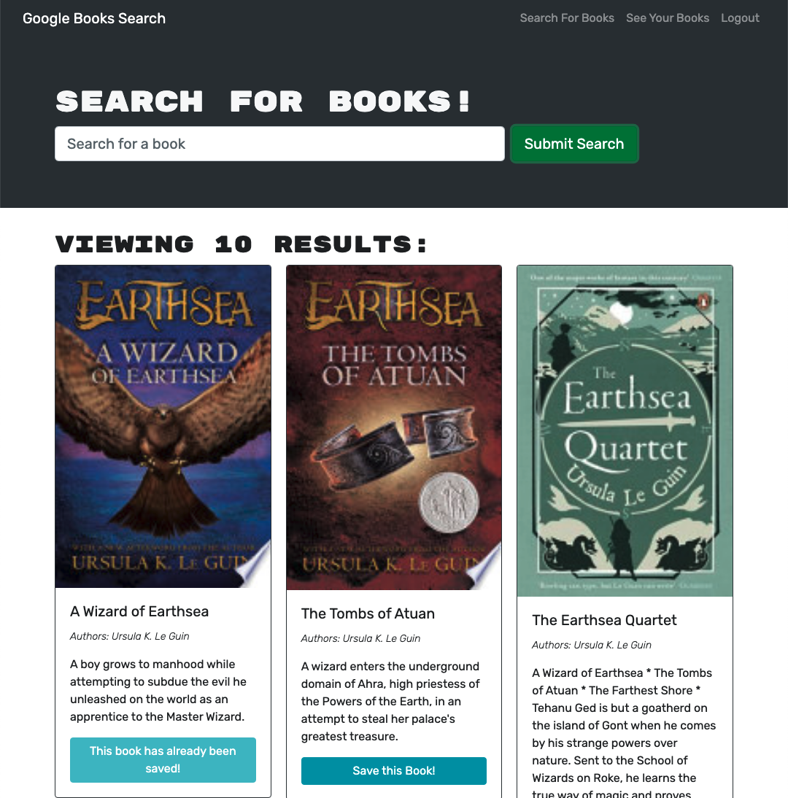

# mern-book-search
  [](https://opensource.org/licenses/MIT)

  ## Description
  This react application allows users to search for books by using the Google Books API. It also uses Mongo database running on an apollo-graphql server to store user login information and allow them to save their favorite books.

  ## Table of Contents

  ♦︎[Installation](#installation)

  ♦︎[Usage](#usage)

  ♦︎[Questions](#questions)

  ## Installation

  To install the necessary dependencies, run the following command:

  ```
  npm i
  ```

  ## Usage
The deployed applicaiton can be found [here.](https://desolate-citadel-24456.herokuapp.com/)


To load the application via this repository, use either npm run start to run it in development mode, or npm run build to run the build which can then be deployed via the index.html. Once running the application different pages can be selected from the navigation bar on the top right. On the home/Search for Books page users can search for books using the search bar. The user will then see a grid of books. If the user is signed in they will be able to save the books. Saved books can then be viewed from the See Your Books tab where they will also be able to remove books from their saved list.
  

  ## License

  This project is licensed under the [MIT](https://opensource.org/licenses/MIT) license.


  ## Questions

  If you have any questions about the repo, open and issue or contact me directly at BradDWagner@outlook.com. You can find more of my work on my [GitHub](https://github.com/BradDWagner).

